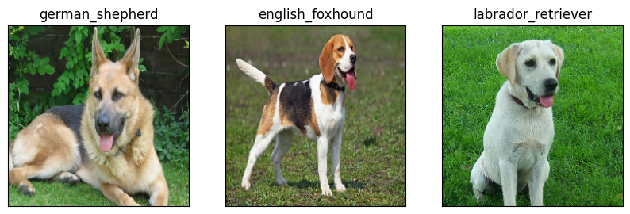

# Dog Breed Identification with TensorFlow 🐶

Welcome to my Dog Breed Identification project! As a beginner in the world of machine learning, I've been learning and trying out new things on my own. This project is one of my learning experiences where I've used TensorFlow, a popular tool for building machine learning models, to teach a computer to recognize different breeds of dogs from pictures.

## What I Did

- **Getting Started:** I started with a big collection of pictures of dogs, each labeled with its breed. These pictures came from a competition called Kaggle, where people share datasets for machine learning projects.

- **Getting Ready:** Before I could teach the computer, I had to do some work on the pictures. I turned them into special types of numbers called tensors so that TensorFlow could understand them.

- **Building the Model:** Then came the fun part! I built a special kind of computer program called a neural network. This network looks at the pictures and learns to recognize patterns that tell it which breed of dog is in each picture.

- **Training the Model:** To teach the program, I showed it lots of pictures of dogs and told it what breed each one was. The program looked at these pictures and adjusted itself to get better at recognizing breeds.

- **Testing the Model:** Once the program had learned enough, I tested it with some new pictures it hadn't seen before. I wanted to see if it could correctly guess the breed of the dogs in these new pictures.

- **Success!:** I'm happy to say that my program did pretty well! It correctly identified many different breeds of dogs from the pictures I showed it.

## Example Output

Here's an example of what my program did with the pictures of dogs:

## What's Next

This project has been a great learning experience for me. As a beginner, I've been able to dive into the exciting world of machine learning and see firsthand how powerful these techniques can be. I'm excited to continue learning and exploring new projects in the future.

Feel free to take a look at my project and see how I've been learning and growing as a beginner in machine learning!
